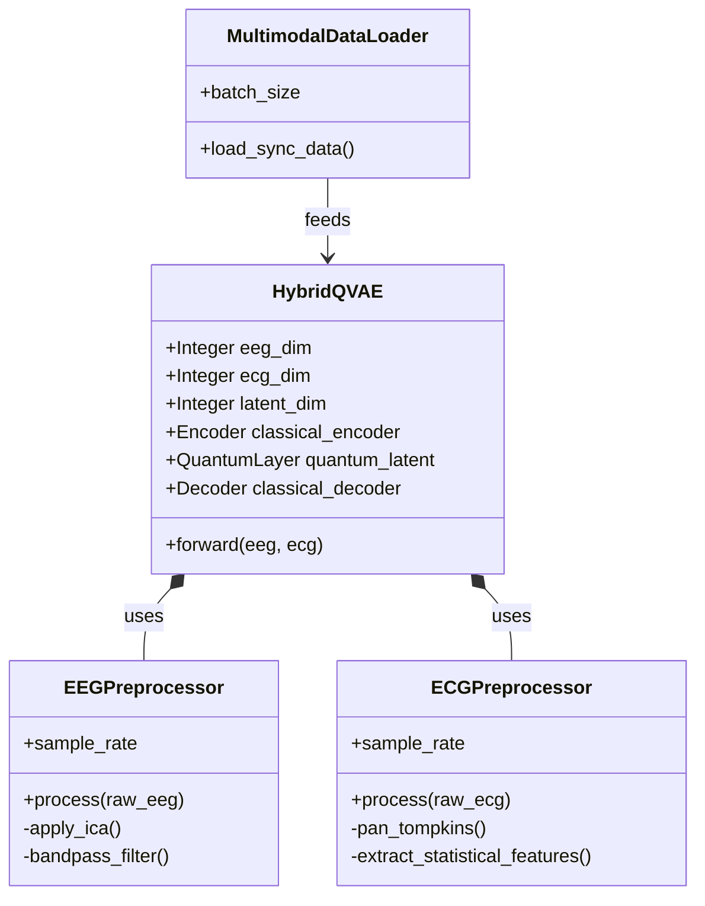
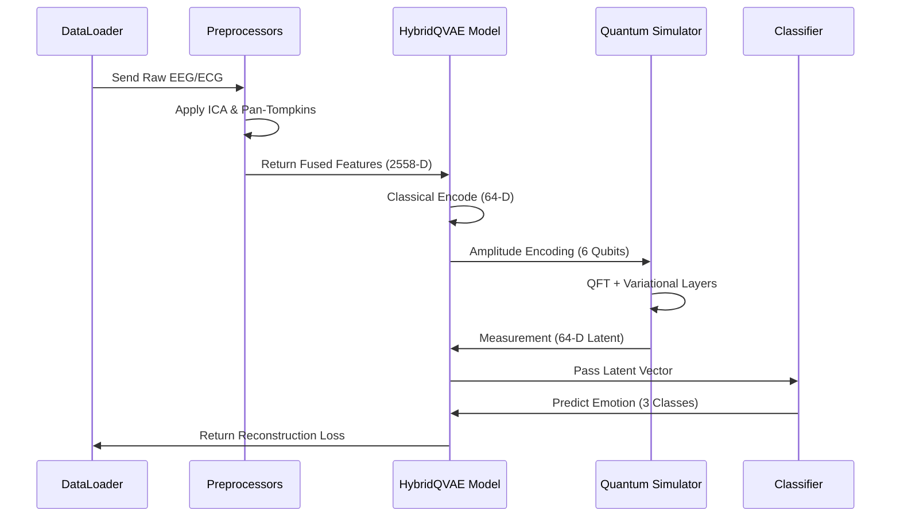

# Project Diagram Guide: Fusion-Aware QVAE

To effectively document this hybrid quantum-classical project, you should use a combination of architectural and UML (Unified Modeling Language) diagrams.

## 1. Core Architectural Diagrams

### 1.1 High-Level System Architecture
- **Purpose**: Show the end-to-end flow from raw signals to emotion prediction.
- **Type**: Flowchart / Block Diagram.
- **Current Status**: Already exists as `architecture_diagram.mmd` and `figures/arch_premium.png`.

### 1.2 Quantum Circuit Diagram
- **Purpose**: Detail the specific quantum gates (Amplitude Encoding, QFT, RY/RZ, CNOT Ring Entanglement).
- **Type**: Quantum Circuit Schema.
- **Current Status**: Already generated via `generate_qiskit_circuit.py`.

---

## 2. Recommended UML Diagrams

### 2.1 UML Class Diagram
- **Purpose**: Visualize the object-oriented structure of the PyTorch/Qiskit implementation.
- **Mermaid Code**:

### 2.2 UML Sequence Diagram
- **Purpose**: Show the synchronous interaction between components during a single training step.
- **Mermaid Code**:

### 2.3 UML Use Case Diagram
- **Purpose**: Define how the user (Researcher) interacts with the system.
- **Components**:
  - **Actor**: Researcher / Data Scientist.
  - **Use Cases**: 
    - Ingest Multimodal Data.
    - Configure Hyperparameters.
    - Train Hybrid Model.
    - Evaluate Emotion Accuracy.
    - Generate Circuit Visualizations.

### 2.4 Activity Diagram
- **Purpose**: Model the specific logic of the Pan-Tompkins algorithm or the ICA artifact removal process.
- **Steps**: Raw ECG -> Derivative -> Squaring -> Integration -> Peak Finding -> Statistical Feature Extraction.

---

## 3. Visualization Tools
- **Mermaid.js**: Best for Class, Sequence, and Flowcharts (used in Markdown).
- **Qiskit/Pennylane**: Best for Quantum Circuit diagrams.
- **Matplotlib/Seaborn**: Best for Result Plots (Loss, Accuracy, Latent Space).
